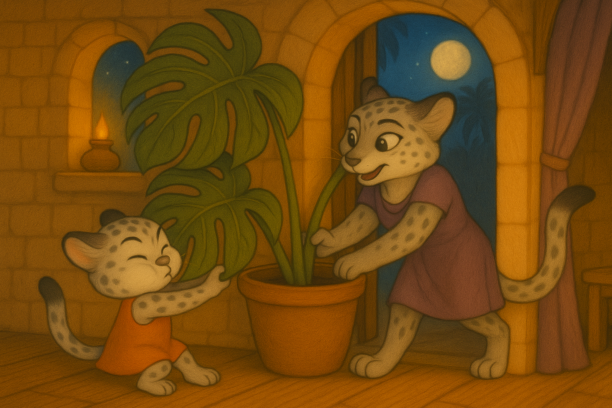
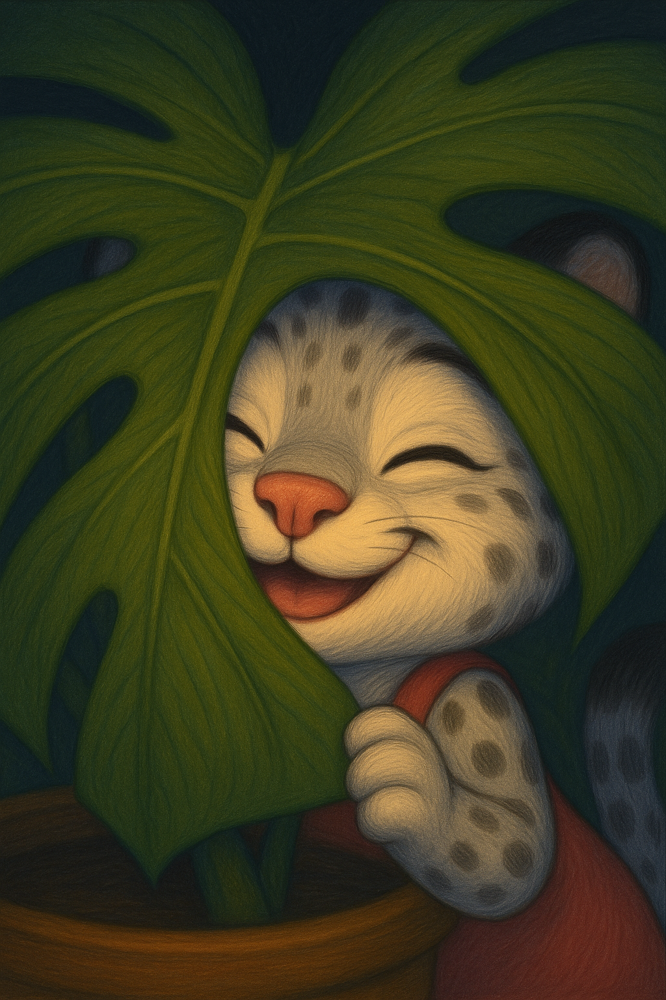
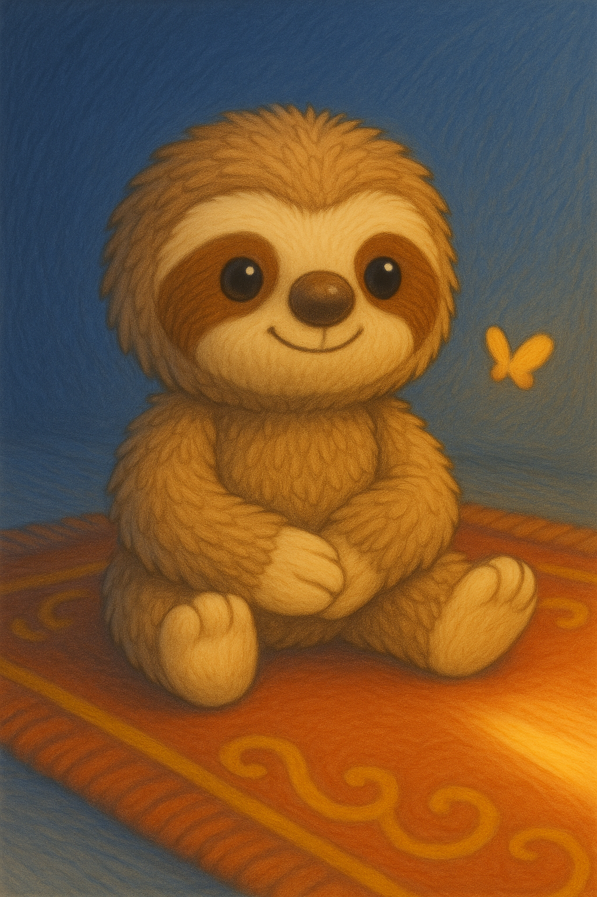
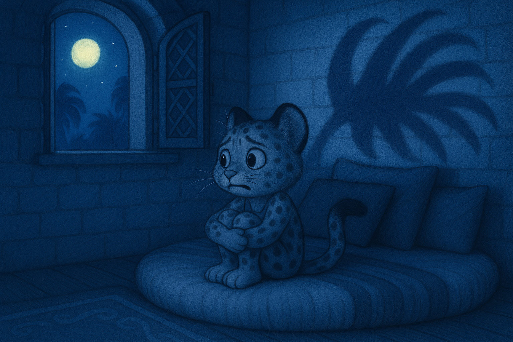
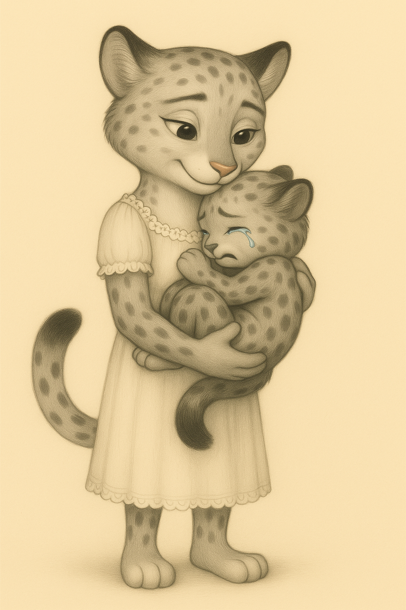
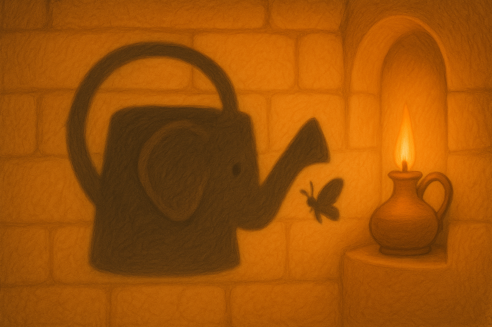
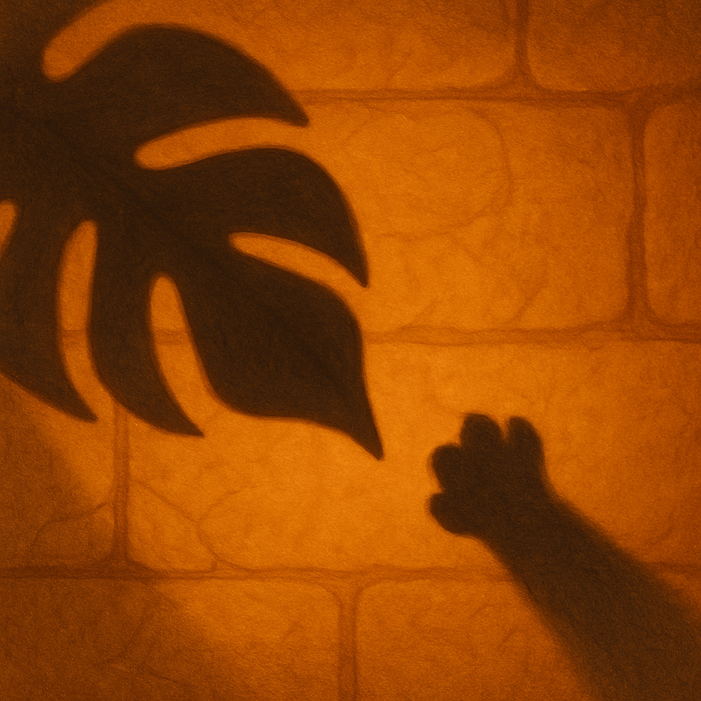

Однажды утром Мама и Лиска вносили в спальню Лиски что-то ОГРОМНОЕ.

— Ещё... чуть-чуть... — пыхтела Мама, толкая тяжеленный горшок.

Лиска упёрлась лапками в пол, схватилась за гигантский лист и потянула со старательным крошечным *йииых*!

С последним толчком — *УФФФ!* — в комнату въехал их новый цветок: огромная монстера. Её листья все были в дырках, прямо как швейцарский сыр.

Маленький розовый носик Лиски просунулся в одну из дырочек.

— Сырный цветок! — воскликнула Лиска. — Я назову тебя Мистер Сырник!

Днём Лиска играла с тенью Мистера Сырника.

— Дай пять! — хихикнула она и шлёпнула ладошкой по тени листа на стене.

Ветер пошевелил листья, и тень убежала. Лиска радостно взвизгнула — *УИИИИИ!* — и бросилась за ней вдогонку.

Перед сном Мама закутала Лиску крепко-крепко, как маленький рулетик с корицей. Плюшевый ленивец Лиски, Ленивчик, уютно устроился у неё под боком. 

Порыв ветра пошевелил листья Мистера Сырника, и его тень вытянулась и закачалась.

Внезапно тени листьев стали длиннее... и острее... и совсем перестали походить на листья. Теперь они были похожи на когти!

Глаза Лиски расширились. "Это же просто Мистер Сырник". Она обняла Ленивчика и натянула одеяло на голову. 

— Уходи, — прошептала она. — Ты просто цветок.

Но под одеялом в её голову полезли страшные мысли: "А что, если тень подкрадётся ближе? А что, если она дотронется до меня? А что, если..."

В груди у нее быстро и громко застучало: ТУДУМ-ТУДУМ. ТУДУМ-ТУДУМ.

Она сбросила одеяло, выкатилась из кровати и выскочила из комнаты.

— МАМА! — закричала она. — У тени КОГТИ, и она хочет меня СХВАТИТЬ!

Мама подхватила её на руки.

— Ох, мой котенок, ты так напугана, — сказала она.

Мама отнесла Лиску обратно в спальню, и они осторожно заглянули внутрь.

— Ты права, — сказала она. — Эта тень и правда немного колючая.

Лиска кивнула, оставляя слёзы и, может быть, немного соплей на маминой ночнушке.

Укладывая Лиску обратно в постель, Мама подняла лапы в луч лунного света и сложила их так, чтобы на стене появилась тень бабочки.

Она задвигала лапами, и тень-бабочка подлетела поближе к тени растения. А потом облетела вокруг её когтистой тени-листа.

Лиска смотрела во все глаза. Тень-бабочка была... красивой? Не страшной?

— Они как будто играют, — прошептала Лиска.

На следующий вечер Лиска попросила:
— Ма-ам, я все еще боюсь эту тень. Помоги мне?

— Конечно, котёнок. Как ты себя чувствуешь?

— Сердце быстро стучит. Тук-тук, тук-тук, тук-тук, — ответила Лиска.

— Тогда давай поможем ему успокоиться. Вдохни, как будто нюхаешь цветок. И выдохни, как будто остужаешь горячий суп. — Лиска сделала медленный *вдооох*... и долгий *выыыдох*.

— Мам, — сказала она, — помнишь бабочку, которую ты делала? Я тоже так хочу.

Мама помогла ей соединить большие пальцы так, чтобы на стене появилась тень-бабочка.

Мама зажгла свечу.

— Смотри, тень от твоей леечки похожа на слоника с длинным хоботом. Думаю, он боится щекотки! Пощекочешь его?

Лиска задвигала лапками и её тень-бабочка облетела слоника раз... другой... и... тюкнула прямо по кончику хобота!

В мерцающем свете свечи тень-хобот задрожала, как будто от смеха. Изо рта Лиски вырвался маленький *фырк*. Хобот, казалось, хотел поиграть.

Вдруг в голове у Лиски появилась новая мысль: "Точно! Я же могу с ними играть!"

Позже ночью тень Мистера Сырника снова растянулась по всей стене. Сердце Лиски забилось, но на этот раз она знала, что делать. Она так крепко сжала Ленивчика, что, казалось, из него вылезет вся набивка. Она "понюхала цветок", *ВДОООХ*, и "остудила суп", *ВЫЫЫДОХ*.

Затем, медленно-медленно, как храбрая улиточка, она встала с кровати. Она подняла дрожащую лапку, и тень лапки появилась на стене. Маленькая, неуверенная, но появилась!

Тень-лапка почти касалась когтистой тени-листа. Сердце Лиски застучало быстрее, и её лапка замерла.

— Давай, тень-лапка, — прошептала она. — Не бойся. Ты сможешь.

Она подвинула лапку вперёд, пока её тень не коснулась тени растения, и...

Ничего не произошло. Никто её не схватил. Просто её тень-лапка легла на тень листа. А её собственная лапка была в безопасности.

— Да ты же совсем не страшная, — сказала Лиска. — Ты просто... еще одна тень! А сделать ты мне ничего не можешь!

Лиска посмотрела на Ленивчика.
 
— Ох, ты тоже боишься? — прошептала она, обнимая его. — Всё в порядке. Давай понюхаем цветок и остудим суп. Вдох... и выдох. А теперь давай играть!

Она подняла Ленивчика и пододвинула его тень прямо к тени в виде когтей. Она двигала Ленивчика всё ближе... ближе... и вдруг *шлёп*! Дала когтистой тени небольшую пятюню! 

А настоящих когтей там и не оказалось. Просто тень ее друга, Мистера Сырника, качалась на ветру.

Мама, наблюдавшая из дверного проёма, рассмеялась.

— Ого, ты так боялась этой колючей тени, но всё равно смогла с ней поиграть!

Лиска ткнулась носом в мамину ладонь и мурлыкнула:

— Мам, я так тебя люблю.

Она посмотрела на тени вокруг.

— Спокойной ночи, Мистер Сырник, — сказала она. — Завтра мы снова будем с тобой играть.